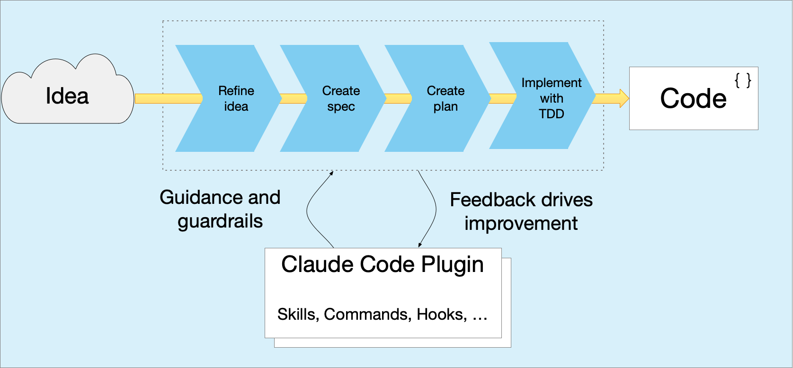

= Idea to Code

Idea to Code is a disciplined, human-in-the-loop Claude Code operating model.

== Key features

* Refines an idea (feature, bug fix, ...) into a specification and implementation plan
* Interactively executes the implementation plan using test-driven development (TDD), with human oversight
* Constrains GenAI interactions with explicit development and debugging instructions
* Implements a feedback loop for continually improving how Claude Code operates

== Why humans in the loop development?

If you want quality software then must be developed by human developers - GenAI is a tool, not a developer.

**The human developer is responsible for the delivered software**

A GenAI coding agent must write code iteratively using TDD.
The developer must carefully review any GenAI-generated code and provide prompt feedback.

== About Idea to Code

Idea to Code consists of the following:

* The `idea-to-code.sh` script that implements the idea to code workflow
* A Claude Code plugin that provides skills, commands and hooks
* Template `CLAUDE.md` and `.settings.local.json`
* Supporting scripts

Let's look at the key features starting with the idea to code workflow.

=== The idea to code workflow

The idea to code workflow consists of the following steps:

. Exploring an idea - an interactive, Claude Code-driven Q&A session to flesh out an idea
. Creating a specification - GenAI creates a specification from the Q&A session
. Creating an implementation plan - a sequence tasks that are prompts for Claude Code
. Executing the implementation plan - running the coding agent to execute the plan

To use this workflow simply run link:./docs/scripts/idea-to-code.adoc[idea-to-code.sh]:

[source,bash]
----
./idea-to-code.sh ~/ideas/some-feature
----

where `~/ideas/some-feature` is a directory that will contain the idea, spec, and implementation plan.

The workflow creates the following files in that directory:

* `some-feature-idea.md` - the initial idea
* `some-feature-discussion.md` - the Q&A discussion
* `some-feature-spec.md` - the specification
* `some-feature-plan.md` - the plan consisting of tasks, which are marked as completed (`[ ] -> [x]`) as the plan is executed

Note: the file name is prefixed with the directory name.

For example, see https://github.com/humansintheloop-dev/humansintheloop-dev-examples-loctree/tree/master/docs/features/loc-outliner[humansintheloop-dev-examples-loctree/docs/features/loc-outliner], which is described in more detail below.

=== Guiding Claude code

Claude code needs guidelines.
This project defines the `idea-to-code` Claude Code plugin along with template `CLAUDE.md` and `.settings.local.json` files.
The plugin defines various skills, commands and hooks.
Key skills include:

* `tdd` - implements a TDD red-green-refactor workflow
* `commit-guidelines` - structures the Git commit message
* ...

Key commands are:

* `commit-changes` - commits staged and unstaged changes
* `claude-issue-report` - described below

There are also session tracking hooks, which are described below.

=== Improving how Claude Code operates

Claude Code regularly makes mistakes and, unlike a human, will repeatedly make the same mistake again.
It's essential, therefore, to continue update the plugin to improve how Claude Code operates.

To support continuous improvement, the `idea-to-code` Claude Code plugin provides the following capabilities:

* `claude-issue-report` - a slash command that reports an issue in `.claude/issues` 
* hooks - record the Claude sessions (`.claude/sessions`) and associate filed issues with the session

NOTE: it's useful to create symbolic links from `.claude/issues` and `.claude/sessions` to project-specific subdirectory in a centralized location, e.g. `~/hitl-tracking`.

In addition, there's are the following scripts:

* `workflow-scripts/review-issues.sh` script - analyzes filed issues and updates the Claude Code plugin
* `workflow-scripts/update-claude-files-from-project.sh` - updates the template files with changes made to a project's `CLAUDE.md` and `.settings.local.json`
* `workflow-scripts/workflow-scripts/update-project-claude-files.sh` - updates a project's `CLAUDE.md` and `.settings.local.json` from the template files.

=== Examples

Here's some examples

* https://github.com/eventuate-platform/eventuate-tram-spring-micrometer-tracing/tree/master[eventuate-tram-spring-micrometer-tracing/tree/master] - provides distributed tracing support for Eventuate Tram using Micrometer Tracing.
Here's the https://github.com/eventuate-platform/eventuate-tram-spring-micrometer-tracing/blob/master/docs/features/use-micrometer-tracing/use-micrometer-tracing-idea.txt[idea file].

* https://github.com/humansintheloop-dev/humansintheloop-dev-examples-loctree[`loctree`], a GoLang terminal user interface (TUI) application that provides an interactive, hierarchical view of lines of code (LOC) counts for a given directory structure. 
See link:./docs/idea-to-code-workflow.adoc[idea to code workflow for Loctree]

== Installation

=== Prerequisites

Install Claude Code - see https://microservices.io/post/architecture/2025/07/09/vibe-coding-good-almost-other-part-2.html[Vibe coding: the good, the almost, and the @#$%** - Part 2] for getting started.

=== Installing the Idea to Code plugin

You can install using either slash commands (inside a Claude Code session) or shell commands.

==== Option 1: Install from GitHub (Published Plugin)

**Using slash commands** (inside Claude Code session):

[source,bash]
----
/plugin marketplace add https://github.com/chrisrichardson/genai-development-workflow
/plugin install idea-to-code
----

**Using shell commands** (from terminal):

[source,bash]
----
claude plugin marketplace add https://github.com/chrisrichardson/genai-development-workflow
claude plugin install idea-to-code
----

==== Option 2: Install from Local Clone (For Development)

If you've cloned the repository locally:

**Using slash commands** (inside Claude Code session):

[source,bash]
----
/plugin marketplace add /path/to/genai-development-workflow
/plugin install idea-to-code
----

**Using shell commands** (from terminal):

[source,bash]
----
claude plugin marketplace add /path/to/genai-development-workflow
claude plugin install idea-to-code
----

After installation, restart Claude Code to load the new plugins.

=== Uninstalling the Plugin

To uninstall the plugin and remove the marketplace:

**Using slash commands** (inside Claude Code session):

[source,bash]
----
/plugin uninstall idea-to-code
/plugin marketplace remove idea-to-code
----

**Using shell commands** (from terminal):

[source,bash]
----
claude plugin uninstall idea-to-code
claude plugin marketplace remove idea-to-code
----

=== Getting the Workflow Scripts

To use the workflow orchestration scripts, clone the repository:

[source,bash]
----
git clone https://github.com/chrisrichardson/genai-development-workflow
cd genai-development-workflow
----

NOTE: Even if you install via plugin, you still need to clone the repository to use the workflow scripts.

== Acknowledgement

The original inspiration and some prompts came from this https://harper.blog/2025/02/16/my-llm-codegen-workflow-atm/[excellent post].

I've subsequently been inspired by https://github.com/nTCoding/claude-skillz/[Nick Tune's work] - most notable the TDD skill and the `/claude-issue-report` command.

