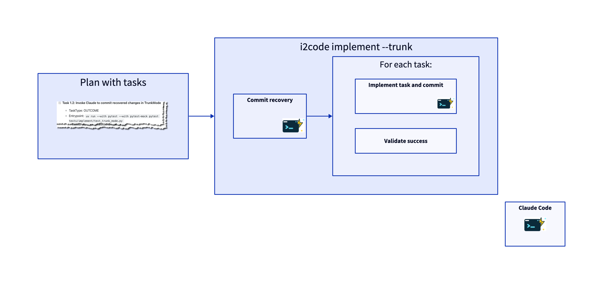
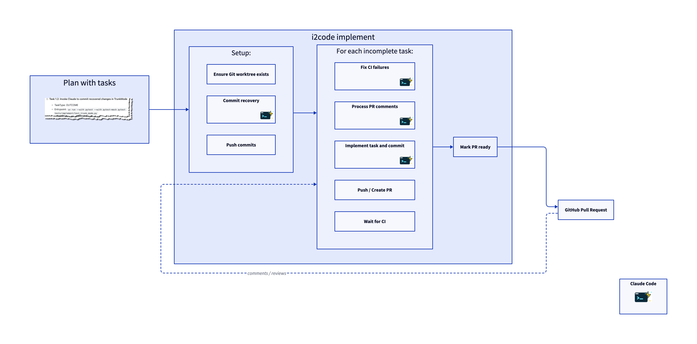
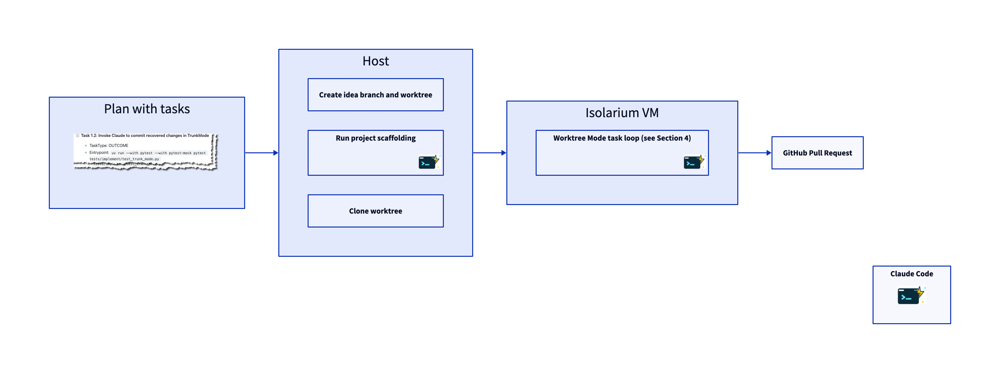

# i2code implement — Execution Steps

## Entry Point

`i2code implement <idea_directory>` takes an idea directory (e.g., `docs/ideas/wip/my-feature/`) and implements the tasks defined in its plan file by invoking Claude for each task.

## 1. Validation Phase

1. **Validate idea directory** — confirms the directory exists.
2. **Validate required files** — checks for `<name>-idea.md` (or `.txt`), `<name>-spec.md`, and `<name>-plan.md`.
3. **Dry run exit** — if `--dry-run`, print the selected mode and exit.
4. **Check idea files committed** — ensures idea files are committed to git. Skipped when `--isolated` or `--ignore-uncommitted-idea-changes`.
5. **Check task completion** — reads the plan file; exits early with "All tasks are already complete" if nothing remains. Skipped when `--address-review-comments` is set (the review polling loop should still run even if all tasks are done).

## 2. Mode Selection

The command selects one of three execution modes based on flags:

| Flag | Mode | Description |
|------|------|-------------|
| `--trunk` | Trunk | Run tasks on the current branch (no worktree, PR, or CI) |
| `--isolate` | Isolate | Delegate to an isolarium VM for sandboxed execution |
| *(default)* | Worktree | Full workflow with git worktree, Draft PR, and CI integration |

### Additional Flags

| Flag | Description |
|------|-------------|
| `--cleanup` | Remove worktree and delete local branches after PR is merged/closed |
| `--address-review-comments` | Keep running after tasks complete, polling for and addressing PR review comments |
| `--skip-scaffolding` | Skip project scaffolding step (isolate mode) |
| `--debug-claude` | Show full Claude output instead of progress dots |
| `--shell` | Drop into an isolarium shell instead of running tasks (implies `--isolate`) |
| `--isolation-type TYPE` | Isolation environment type (passed as `--type` to isolarium, implies `--isolate`) |
| `--mock-claude SCRIPT` | Use mock script instead of Claude (for testing) |
| `--extra-prompt TEXT` | Extra text to append to Claude's prompt |
| `--skip-ci-wait` | Skip waiting for CI after push (for testing) |

## 3. Trunk Mode (`--trunk`)

Simplest mode — runs tasks directly on the current branch.

### Steps

1. **Commit recovery** — checks if a previous run left uncommitted changes from a completed task. If found, invokes Claude to commit them (up to 2 attempts).
2. **Task loop** — for each incomplete task in the plan file:
    a. Build a Claude command with the task description from `task_execution.j2`.
    b. Run Claude (up to 3 attempts per task).
    c. Validate success (see [Success Criteria](#success-criteria)).
3. Print "All tasks completed!" when done.

## 4. Worktree Mode (default)

Full workflow with git isolation, Draft PR creation, and CI monitoring.

### Setup (`ImplementCommand._worktree_mode`)

1. **Check task completion** — exits early if all tasks are complete (skipped when `--address-review-comments` is set).
2. **Create idea branch** — creates or reuses an `idea/<name>` branch.
3. **Create/reuse worktree** — creates a git worktree for the idea branch (or reuses the current directory when `--isolated`).
4. **Setup worktree** — copies necessary project config into the worktree.
5. **Setup-only exit** — if `--setup-only`, print "Setup complete" and exit.
6. **Find existing PR** — reuses a Draft PR if one already exists for the branch. If `--address-review-comments` is set and no PR exists, exit with an error.

### Main Loop (`WorktreeMode.execute`)

7. **Commit recovery** — checks if a previous run left uncommitted changes from a completed task. If found, invokes Claude to commit them (up to 2 attempts).
8. **Push unpushed commits** — if the branch was previously pushed and has new local commits, push and ensure a PR exists.

Then repeats until all tasks are done:

9. **Check/fix CI failures** — if CI is failing on the current HEAD, invoke Claude to fix it (up to `--ci-fix-retries` attempts, default 3). Push each fix and wait for CI. If a fix was attempted, restart the loop from step 9.
10. **Process PR review feedback** — fetch unprocessed review comments, reviews, and conversation comments. Triage via Claude into "will fix" and "needs clarification" groups. Reply with clarifications, invoke Claude for fixes, push, and reply with commit SHAs. If feedback was processed, restart the loop from step 9.
11. **Execute next task**:
    a. Build and run the Claude command (up to 3 attempts).
    b. Validate success (see [Success Criteria](#success-criteria)).
    c. Push changes to remote.
    d. Create a Draft PR if one doesn't exist.
    e. Wait for CI to complete (respects `--ci-timeout`, default 600s).

### Completion

1. Mark the Draft PR as ready for review.
2. Print the PR URL.
3. **Review polling** (optional) — if `--address-review-comments` is set, enter a polling loop that repeatedly checks for CI failures and new review feedback until the PR is merged or closed. Sleeps between polls.

## 5. Isolate Mode (`--isolate`)

Delegates execution to an isolarium VM for sandboxed execution.

### First Run (`IsolateMode._setup_worktree_and_launch`)

1. **Create idea branch and worktree** — creates `idea/<name>` branch and a git worktree, same as worktree mode setup.
2. **Run project scaffolding** (`ProjectScaffolder.ensure_scaffolding_setup`) — invokes Claude to generate build tooling (e.g., Gradle wrapper, CI workflow file). Guarded by a `.hitl_dev/scaffolding-done` file so it runs only once. After scaffolding, pushes to remote and waits for CI. If CI fails, invokes the build fixer. Skipped when `--skip-scaffolding` is set.
3. **Clone the worktree** — creates a local clone of the worktree for isolarium to operate on.
4. **Launch isolarium** — runs `isolarium run -- i2code implement --isolated <idea_dir>` inside the VM.

Inside the VM, `--isolated` causes `ImplementCommand._worktree_mode()` to run, which skips worktree creation (reuses the current directory) and proceeds to `WorktreeMode.execute()` for the main task loop described in section 4.

### Subsequent Runs (`IsolateMode._launch_in_existing_clone`)

1. **Reuse existing clone** — if a clone from a previous run exists, configure git user, set up the clone, and launch isolarium directly.

## Success Criteria

Each Claude task invocation is validated against these criteria:

| # | Check | On failure | Applies to |
|---|-------|------------|------------|
| 1 | Exit code is 0 | Retry (up to 3 attempts) | All modes |
| 2 | HEAD advanced (a commit was made) | Retry (up to 3 attempts) | All modes |
| 3 | `<SUCCESS>` tag present in stdout | Hard exit (`sys.exit(1)`) | Non-interactive only |
| 4 | Task marked complete in plan file | Retry (up to 3 attempts) | All modes |
| 5 | CI workflow file exists in `.github/workflows/` | Retry (up to 3 attempts) | Worktree mode only |

### The `<SUCCESS>` Tag

The `task_execution.j2` prompt template instructs Claude to output one of:
- `<SUCCESS>task implemented: COMMIT_SHA</SUCCESS>` — on success
- `<FAILURE>Explanation of failure</FAILURE>` — on failure

In non-interactive mode (`--non-interactive`), Claude's stdout is captured via `--output-format=stream-json`. The `<SUCCESS>` tag is checked as an additional confidence signal. In interactive mode, stdout is not captured (it drives the TUI), so this check is skipped.

## Commit Recovery

On startup (before the task loop), both trunk and worktree modes check for uncommitted changes left by a previous crashed run:

1. Diff the plan file against HEAD.
2. Parse both the working-tree and HEAD versions of the plan.
3. If any task transitioned from incomplete to complete but wasn't committed, invoke Claude in non-interactive mode to commit the changes.
4. Retry up to 2 times. If recovery fails, exit with an error asking the user to commit manually.

## Key Source Files

| File | Purpose |
|------|---------|
| `src/i2code/implement/cli.py` | Click command definition and option parsing |
| `src/i2code/implement/implement_command.py` | Top-level orchestrator, mode dispatch |
| `src/i2code/implement/mode_factory.py` | Creates mode instances with wired dependencies |
| `src/i2code/implement/trunk_mode.py` | Trunk mode execution |
| `src/i2code/implement/worktree_mode.py` | Worktree mode execution with PR/CI loop |
| `src/i2code/implement/isolate_mode.py` | Isolate mode delegation to isolarium |
| `src/i2code/implement/project_scaffolding.py` | Project scaffolding orchestration (isolate mode) |
| `src/i2code/implement/commit_recovery.py` | Detects and recovers uncommitted completed tasks |
| `src/i2code/implement/claude_runner.py` | Claude process management and result diagnostics |
| `src/i2code/implement/command_builder.py` | Builds all Claude CLI commands from templates |
| `src/i2code/implement/github_actions_build_fixer.py` | Detects and fixes CI failures via Claude |
| `src/i2code/implement/pull_request_review_processor.py` | Processes PR review feedback via triage |
| `src/i2code/implement/github_actions_monitor.py` | Waits for CI completion and reports results |
| `src/i2code/implement/idea_project.py` | Idea directory, plan file, and task state |
