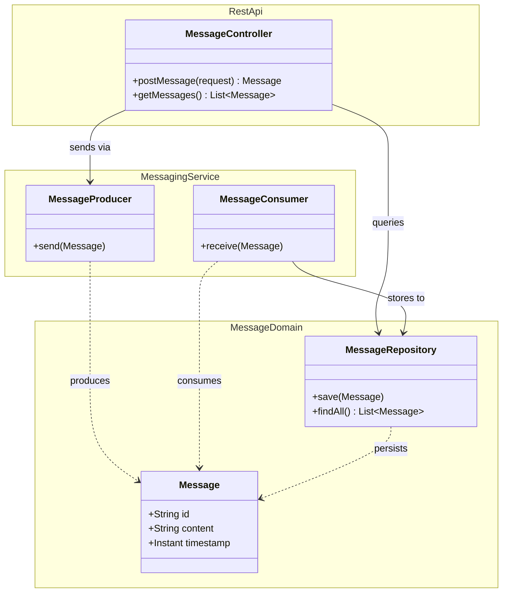
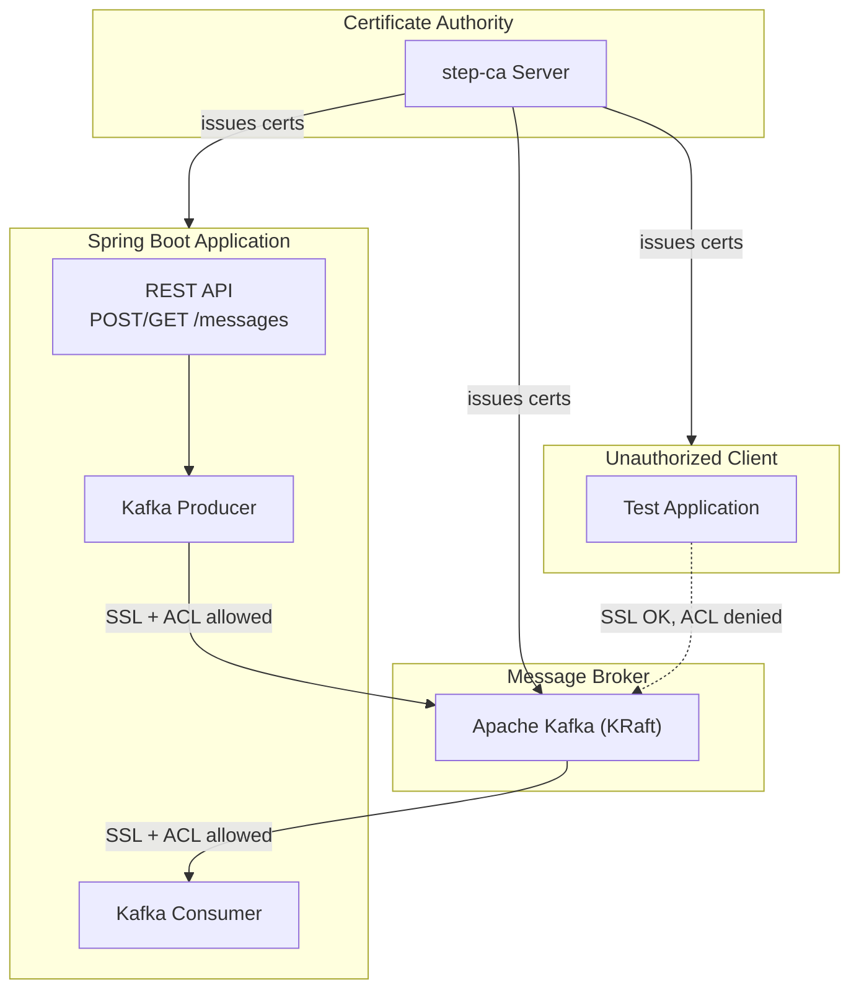
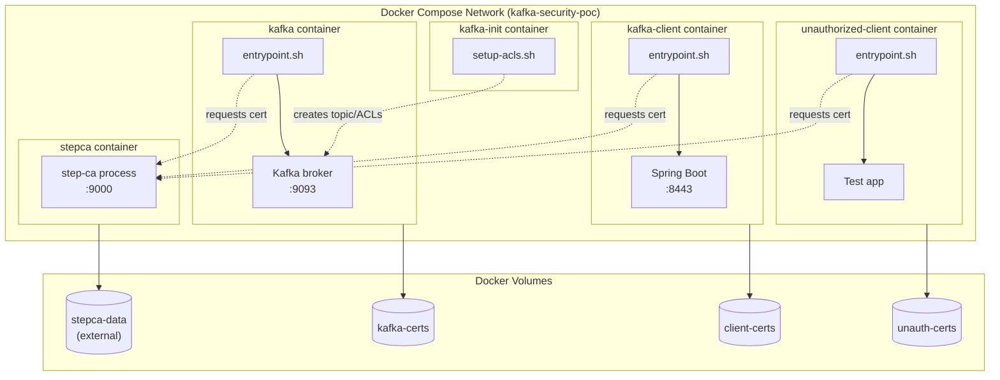
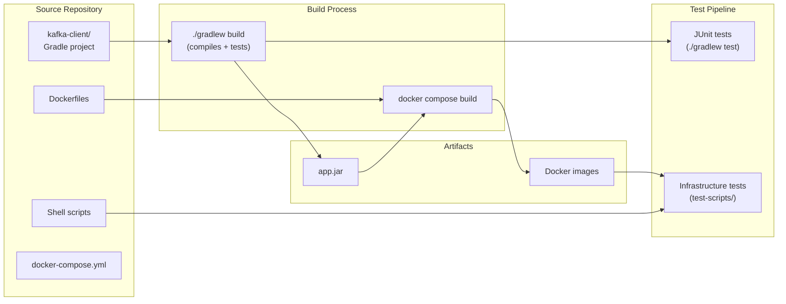

# Kafka Security POC - Design Document

## 1. Overview

### Summary

This POC validates that a Spring Boot application can securely communicate with a Kafka broker using:
- **Mutual TLS (mTLS) authentication**: Both client and broker authenticate each other via certificates
- **ACL-based topic authorization**: Only authorized certificate CNs can access specific topics
- **Smallstep step-ca integration**: Dynamic certificate provisioning via entrypoint scripts

### Key Goals

1. Demonstrate mTLS authentication between Spring Boot and Kafka
2. Prove ACL enforcement blocks unauthorized clients (valid cert, wrong CN)
3. Build on existing Smallstep certificate infrastructure patterns from `~/src/smallstep-cert-example`
4. Provide a reusable pattern for secure Kafka deployments

### Constraints

- Docker Compose deployment only (no Kubernetes)
- Apache Kafka with KRaft mode (no Zookeeper)
- PKCS12 keystores for Java compatibility
- Shell script tests for infrastructure verification (per `testing-scripts-and-infrastructure` skill)
- Java code tested via Gradle/JUnit (per `test-runner-java-gradle` skill)
- POC scope: no certificate renewal, high availability, or production hardening

---

## 2. Domain View

The domain is deliberately simple - this is an infrastructure POC, not a business application.



### Domain Elements

| Element | Purpose |
|---------|---------|
| **Message** | Java record representing a JSON message with id, content, and timestamp. UUID auto-generated on creation. |
| **MessageRepository** | In-memory store (ConcurrentHashMap) for consumed messages. No persistence needed for POC. |
| **MessageProducer** | Spring Kafka producer that sends messages to `secure-messages` topic via mTLS. |
| **MessageConsumer** | Spring Kafka listener that receives messages and stores them in the repository. |
| **MessageController** | REST endpoint exposing POST/GET for messages. Entry point for all user interactions. |

### Domain Patterns

- **Record pattern**: `Message` is a Java record (immutable value object)
- **Repository pattern**: `MessageRepository` abstracts in-memory storage
- **Service layer**: Producer/Consumer encapsulate Kafka interactions separately from REST API

---

## 3. Component View



### Component Descriptions

| Component | Responsibility | Interfaces |
|-----------|---------------|------------|
| **Certificate Authority (step-ca)** | Issues X.509 certificates for all components. Single source of trust. | HTTPS :9000 (ACME-like API) |
| **Message Broker (Kafka)** | Stores and delivers messages. Enforces SSL client auth and ACLs. | SSL :9093 (Kafka protocol) |
| **Spring Boot Application** | Business logic: REST API, message production/consumption. | HTTPS :8443 (REST API) |
| **Unauthorized Client** | Negative test: valid mTLS cert but wrong CN, should be ACL-denied. | None (test utility) |

### Component Interfaces

| From | To | Protocol | Port | Authentication |
|------|-----|----------|------|----------------|
| REST Client | Spring Boot App | HTTPS | 8443 | Server cert only (one-way TLS) |
| Spring Boot App | Kafka | Kafka over SSL | 9093 | mTLS (client cert CN: `kafka-client.local`) |
| Kafka (internal) | step-ca | HTTPS | 9000 | Provisioner password |
| Unauthorized Client | Kafka | Kafka over SSL | 9093 | mTLS (client cert CN: `unauthorized.local`) |

### ACL Configuration

| Principal | Resource | Operations | Permission |
|-----------|----------|------------|------------|
| `User:CN=kafka-client.local` | Topic: `secure-messages` | READ, WRITE, DESCRIBE | ALLOW |
| `User:CN=kafka-client.local` | Group: `secure-messages-group` | READ | ALLOW |
| `User:CN=unauthorized.local` | (none configured) | - | DENY (default) |

---

## 4. Deployment View



### Container Specifications

| Container | Base Image | Custom Additions | Purpose |
|-----------|------------|------------------|---------|
| `stepca` | `smallstep/step-ca` | None | Certificate authority |
| `kafka` | `confluentinc/cp-kafka:7.5.0` | step CLI, entrypoint.sh | Kafka broker with mTLS |
| `kafka-client` | `eclipse-temurin:21-jre` | step CLI, entrypoint.sh, app.jar | Authorized Spring Boot app |
| `kafka-init` | `confluentinc/cp-kafka:7.5.0` | setup-acls.sh | Topic and ACL creation |
| `unauthorized-client` | `eclipse-temurin:21-jre` | step CLI, entrypoint.sh | Negative test client |

### Volume Strategy

| Volume | Type | Purpose |
|--------|------|---------|
| `stepca-data` | External | Persists CA state across restarts. Created by init-ca.sh. |
| `kafka-certs` | Anonymous | Ephemeral broker certificates |
| `client-certs` | Anonymous | Ephemeral client certificates |
| `unauth-certs` | Anonymous | Ephemeral unauthorized client certificates |

### Runtime Environment

**Platform**: Docker Compose v2

| Container | Base Image | Customizations |
|-----------|------------|----------------|
| `stepca` | `smallstep/step-ca` | JWK provisioner config |
| `kafka` | `confluentinc/cp-kafka:7.5.0` | step CLI, custom entrypoint |
| `kafka-client` | `eclipse-temurin:21-jre` | Spring Boot JAR, step CLI |
| `unauthorized-client` | `eclipse-temurin:21-jre` | Minimal test client, step CLI |

### Security Infrastructure

| Aspect | Implementation |
|--------|----------------|
| Certificate Authority | Smallstep step-ca with JWK provisioner |
| TLS Protocol | TLSv1.3 |
| Keystore Format | PKCS12 (.p12) |
| Kafka Authorization | `StandardAuthorizer` with `allow.everyone.if.no.acl.found=false` |
| Secrets Management | `.env` file (gitignored) |

### Startup Sequence

```bash
# 1. Initialize CA (one-time setup)
./scripts/init-ca.sh

# 2. Start CA
docker compose up -d stepca

# 3. Start Kafka broker (waits for CA, requests cert)
docker compose up -d kafka

# 4. Configure topic and ACLs
./scripts/setup-acls.sh

# 5. Start authorized client
docker compose up -d kafka-client

# 6. Run tests
./test-scripts/test-end-to-end.sh
```

### Shutdown Sequence

```bash
# Stop all containers
docker compose down

# Optional: Remove volumes (full cleanup)
docker compose down -v
docker volume rm stepca-data
```

### Environment Variables

| Variable | Purpose | Set By |
|----------|---------|--------|
| `CA_FINGERPRINT` | step-ca root certificate fingerprint | init-ca.sh -> .env |
| `PROVISIONER_PASSWORD` | Password for step-ca provisioner | init-ca.sh -> .env |
| `KEYSTORE_PASSWORD` | PKCS12 keystore password | .env (user configurable) |
| `TRUSTSTORE_PASSWORD` | PKCS12 truststore password | .env (user configurable) |

---

## 5. Build View



### Repository Structure

```
kafka-security-poc/
├── docker-compose.yml              # Container orchestration
├── .env.example                    # Environment template
├── .gitignore                      # Git ignore rules
├── README.md                       # Setup and usage docs
│
├── scripts/                        # Setup scripts
│   ├── init-ca.sh                  # Initialize step-ca, output fingerprint
│   └── setup-acls.sh               # Create topic and configure ACLs
│
├── test-scripts/                   # Infrastructure test scripts
│   ├── test-cleanup.sh             # Remove containers and volumes
│   ├── test-init-ca.sh             # Test CA initialization
│   ├── test-kafka-startup.sh       # Test broker starts with certs
│   ├── test-client-startup.sh      # Test client gets certs and connects
│   ├── test-message-flow.sh        # Test send/receive via REST API
│   ├── test-unauthorized-client.sh # Test ACL denies unauthorized CN
│   └── test-end-to-end.sh          # Master test runner (calls all above)
│
├── kafka-broker/                   # Kafka container build
│   ├── Dockerfile                  # Based on cp-kafka + step CLI
│   └── entrypoint.sh               # Request cert, configure SSL, start Kafka
│
├── kafka-client/                   # Spring Boot application
│   ├── Dockerfile                  # Based on eclipse-temurin:21-jre
│   ├── entrypoint.sh               # Request cert, convert to PKCS12, start app
│   ├── build.gradle                # Gradle build configuration
│   ├── settings.gradle             # Gradle settings
│   └── src/
│       ├── main/
│       │   ├── java/
│       │   │   └── com/example/kafkaclient/
│       │   │       ├── KafkaClientApplication.java
│       │   │       ├── controller/
│       │   │       │   └── MessageController.java
│       │   │       ├── model/
│       │   │       │   └── Message.java
│       │   │       ├── service/
│       │   │       │   ├── MessageProducer.java
│       │   │       │   └── MessageConsumer.java
│       │   │       └── repository/
│       │   │           └── MessageRepository.java
│       │   └── resources/
│       │       └── application.yml
│       └── test/
│           └── java/
│               └── com/example/kafkaclient/
│                   ├── controller/
│                   │   └── MessageControllerTest.java
│                   ├── service/
│                   │   ├── MessageProducerTest.java
│                   │   └── MessageConsumerTest.java
│                   └── repository/
│                       └── MessageRepositoryTest.java
│
├── unauthorized-client/            # Negative test client
│   ├── Dockerfile                  # Same as kafka-client
│   └── entrypoint.sh               # Request cert with unauthorized.local CN
│
└── .github/
    └── workflows/
        └── ci.yml                  # GitHub Actions CI workflow
```

### Build Projects

| Project | Build Tool | Output | Dependencies |
|---------|------------|--------|--------------|
| kafka-client | Gradle 8.x | app.jar | Spring Boot 3.4.x, Spring Kafka |

### CI/CD Pipeline (GitHub Actions)

Per the `github-workflow-gradle-template` skill:

```yaml
name: CI

on:
  push:
    branches: [ main ]
  pull_request:
    branches: [ main ]

jobs:
  build:
    runs-on: ubuntu-latest
    steps:
      - uses: actions/checkout@v4

      - name: Set up JDK 21
        uses: actions/setup-java@v4
        with:
          java-version: '21'
          distribution: 'temurin'

      - name: Setup Gradle
        uses: gradle/actions/setup-gradle@v4
        with:
          cache-read-only: false

      - name: Build with Gradle
        working-directory: kafka-client
        run: ./gradlew build

      - name: Run infrastructure tests
        run: ./test-scripts/test-end-to-end.sh
```

### Testing Strategy

Per the skill guidelines:

| Layer | Tool | Location | What It Tests |
|-------|------|----------|---------------|
| Unit | JUnit 5 + Gradle | `kafka-client/src/test/java` | Controller, Producer, Consumer, Repository logic |
| Infrastructure | Shell scripts | `test-scripts/` | Docker containers, certificate flow, ACL enforcement |

**Important guidelines from skills**:
- **`testing-scripts-and-infrastructure`**: Shell scripts test infrastructure (Docker, Kafka, certificates). Java application logic is tested ONLY via JUnit (`./gradlew test`). Shell scripts NEVER use `gradlew bootRun` to test the application.
- **`test-runner-java-gradle`**: Use `./gradlew test` for unit tests, `./gradlew check` for all tests. Never delete tests to make builds pass.
- **`incremental-development`**: Build one component at a time, verify before proceeding.

### Test Scripts Summary

Per `testing-scripts-and-infrastructure` skill:
- All test scripts go in `test-scripts/` subdirectory
- Each `test-xyz.sh` tests a specific behavior
- `test-end-to-end.sh` runs `test-cleanup.sh` first, then all tests in sequence
- CI workflows call `./test-scripts/test-end-to-end.sh`, not individual scripts

| Script | Purpose | Observable Outcome |
|--------|---------|-------------------|
| `test-cleanup.sh` | Remove containers and volumes | Clean state, exit 0 |
| `test-init-ca.sh` | Test CA initialization | stepca-data volume exists, CA fingerprint extractable |
| `test-kafka-startup.sh` | Test broker starts with certs | Kafka container healthy, listening on 9093 |
| `test-client-startup.sh` | Test client gets certs and connects | kafka-client container healthy, actuator responds |
| `test-message-flow.sh` | Test send/receive via REST API | POST returns 201, GET returns sent message |
| `test-unauthorized-client.sh` | Test ACL denies unauthorized CN | TopicAuthorizationException in logs |
| `test-end-to-end.sh` | Master test runner | All above tests pass |

---

## 6. Key Design Decisions

### Decision 1: Entrypoint Script Certificate Provisioning

**Choice**: Each container requests its certificate at startup via an entrypoint script.

**Rationale**:
- Matches the existing `smallstep-cert-example` pattern
- Certificates are ephemeral, regenerated on each container start
- No pre-shared secrets in images or repos
- Simpler than sidecar or init container approaches

**Trade-off**: Startup is slower (must wait for CA), but acceptable for POC.

### Decision 2: PKCS12 Keystore Format

**Choice**: Use PKCS12 (.p12) format for keystores and truststores.

**Rationale**:
- Native support in Java 9+ (no JKS conversion needed)
- Single file contains both certificate and private key
- Compatible with Spring Boot's SSL auto-configuration
- Industry-standard format

### Decision 3: In-Memory Message Storage

**Choice**: Store consumed messages in a ConcurrentHashMap, not a database.

**Rationale**:
- This is a security POC, not a persistence POC
- Eliminates database container complexity
- Messages only need to survive long enough for tests to verify
- Simplifies the domain model

### Decision 4: Separate Test Scripts for Infrastructure

**Choice**: Use `test-scripts/` directory with shell scripts for infrastructure tests (per `testing-scripts-and-infrastructure` skill).

**Rationale**:
- Infrastructure behavior (certificate provisioning, ACL enforcement) is best verified by actually running containers
- Shell scripts can observe Docker logs, make curl requests, check exit codes
- Java tests would require testcontainers overhead for infrastructure scenarios
- Clean separation: JUnit for Java logic, shell for Docker/infrastructure

### Decision 5: KRaft Mode (No Zookeeper)

**Choice**: Use Apache Kafka 3.6+ with KRaft mode.

**Rationale**:
- Zookeeper is deprecated in Kafka 3.x
- KRaft simplifies deployment (one less component)
- Modern approach that matches production trends
- Simpler SSL configuration without Zookeeper

### Decision 6: Dockerfile Layer Ordering

**Choice**: Order Dockerfile instructions from most stable to least stable (per `dockerfile-guidelines` skill).

**Rationale**:
- Base image and system tools change rarely
- Application JAR changes frequently
- Maximizes Docker layer cache hits during development

Example for kafka-client:
```dockerfile
# 1. Base image (most stable)
FROM eclipse-temurin:21-jre
WORKDIR /app

# 2. System dependencies (stable)
RUN apt-get update && apt-get install -y curl ca-certificates wget && \
    wget -O step-cli.tar.gz https://... && \
    apt-get clean && rm -rf /var/lib/apt/lists/*

# 3. Entrypoint script (changes occasionally)
COPY entrypoint.sh /app/entrypoint.sh
RUN chmod +x /app/entrypoint.sh

# 4. Application JAR (changes frequently)
COPY build/libs/app.jar /app/app.jar

EXPOSE 8443
ENTRYPOINT ["/app/entrypoint.sh"]
```

### Decision 7: SSL Security Protocol

**Choice**: `SSL` protocol (not `SASL_SSL`)

**Rationale**:
- Certificate CN maps directly to Kafka principal
- Simpler than combining SASL with SSL
- Sufficient for demonstrating mTLS + ACL

**Trade-off**: Cannot demonstrate SASL mechanisms

---

## 7. Technical Risks and Mitigations

### Risk 1: Certificate Timing Issues

**Risk**: Containers may start before step-ca is ready, causing certificate request failures.

**Mitigation**:
- Entrypoint scripts poll step-ca health endpoint (`/health`) before requesting certificates
- Use exponential backoff with timeout
- Docker Compose `depends_on` provides startup ordering (but not readiness)

### Risk 2: Kafka ACL Principal Mapping

**Risk**: Kafka may not correctly extract the CN from client certificates for ACL matching.

**Mitigation**:
- Configure `ssl.principal.mapping.rules` explicitly if needed
- Use the exact format `User:CN=kafka-client.local` in ACLs
- Test with negative case (unauthorized-client) to prove ACLs work

### Risk 3: PKCS12 Password Handling

**Risk**: Keystore passwords passed via environment variables could be logged.

**Mitigation**:
- Use `changeit` for POC (known insecure default for testing)
- In production, use Docker secrets or Vault
- Mark environment variables as sensitive in documentation

### Risk 4: Test Flakiness Due to Startup Order

**Risk**: Infrastructure tests may fail if containers aren't fully ready.

**Mitigation**:
- Test scripts include wait loops for readiness
- Use health checks on all containers
- `test-end-to-end.sh` runs `test-cleanup.sh` first for clean state

### Risk 5: Spring Kafka Dynamic Keystores

**Risk**: Spring Boot SSL config may not work with keystores created at runtime.

**Mitigation**:
- Use `file:/certs/...` paths (not classpath)
- Ensure keystores exist before Spring context loads (entrypoint.sh responsibility)
- Document any custom `KafkaConfig` requirements if needed

---

## 8. Open Questions

### Question 1: Certificate Validity Period

**Question**: What should the certificate validity period be?

**Current assumption**: 24 hours (default for step-ca). Acceptable for POC since containers are short-lived.

**Deferred decision**: Certificate renewal is explicitly out of scope.

### Question 2: Consumer Error Handling

**Question**: How should the consumer handle deserialization errors or invalid messages?

**Current assumption**: Let Spring Kafka's default error handler log the error. No dead-letter queue for POC.

**Deferred decision**: Error handling strategy depends on production requirements.

### Question 3: Unauthorized Client Implementation

**Question**: Should the unauthorized-client be a full Spring Boot app or a minimal Kafka producer script?

**Current assumption**: Minimal script using kafka-console-producer is sufficient - just needs to prove ACL denial.

**Consideration**: A full app would allow testing both produce and consume denial, but adds complexity.

### Question 4: Health Check Depth

**Question**: Should the health endpoint verify actual Kafka connectivity?

**Recommendation**: Include Kafka health indicator - proves mTLS connection works.

---

## Appendix: Skill Integration Summary

This design incorporates guidelines from the following skills:

| Skill | How Applied |
|-------|-------------|
| **dockerfile-guidelines** | Dockerfiles order instructions by stability (base image -> system tools -> app code) |
| **incremental-development** | Implementation will build one component at a time, verifying before proceeding |
| **commit-guidelines** | Commits will use "Co-authored by Claude Code" format |
| **tdd** | Java classes developed test-first using RED-GREEN-REFACTOR cycle |
| **file-organization** | Use `git mv` for file moves, prefer dedicated tools over bash |
| **plan-tracking** | Implementation plan will use checkboxes, updated immediately after each task |
| **debugging-ci-failures** | Read full error messages before fixing; verify locally |
| **test-runner-java-gradle** | Use `./gradlew test` for Java tests; never use `bootRun` in test scripts |
| **testing-scripts-and-infrastructure** | Shell scripts in `test-scripts/`, test infrastructure only, include `test-end-to-end.sh` |
| **github-workflow-gradle-template** | CI uses actions/checkout@v4, actions/setup-java@v4, gradle/actions/setup-gradle@v4 |

---

## Change History

### 2026-02-04: Complete regeneration of design document

Regenerated design document from specification files with comprehensive skill integration:
- Added explicit testing strategy per `testing-scripts-and-infrastructure` and `test-runner-java-gradle` skills
- Added test scripts table with observable outcomes
- Added Dockerfile layer ordering guidance per `dockerfile-guidelines` skill
- Added CI workflow template per `github-workflow-gradle-template` skill
- Ensured all scripts referenced in other sections appear in Build View repository structure
- Added Appendix summarizing skill integration
