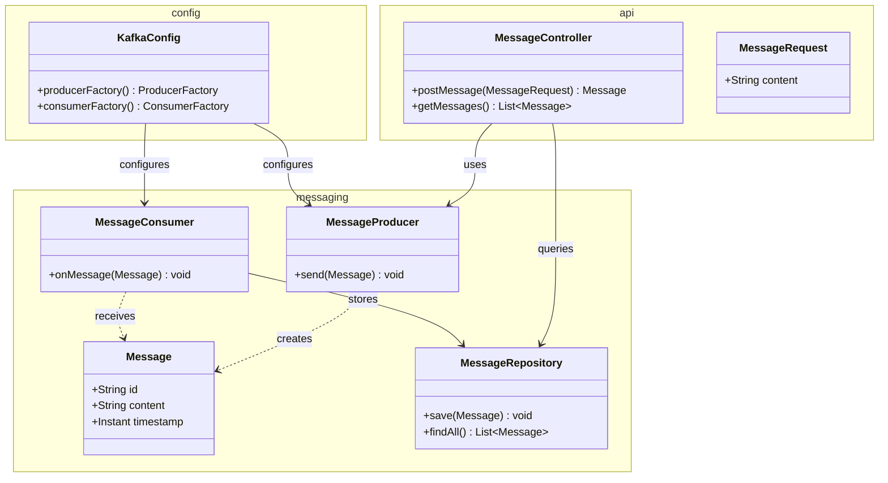
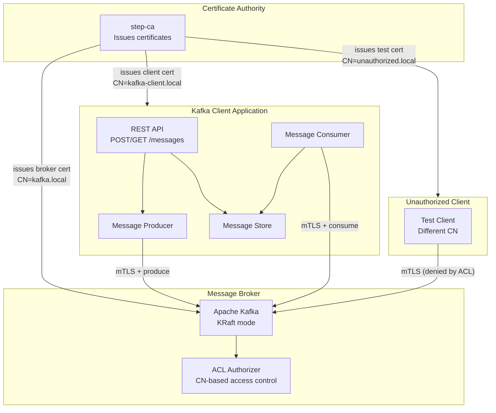
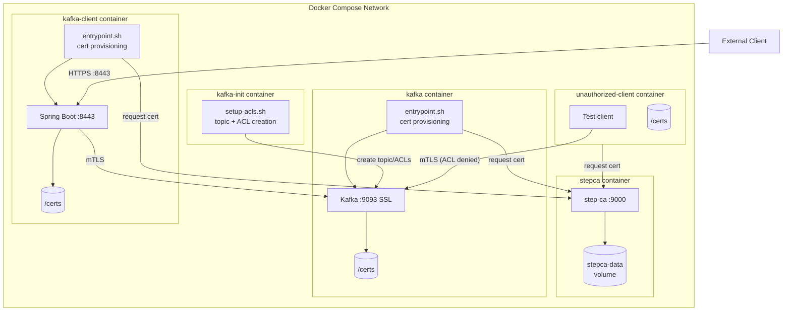
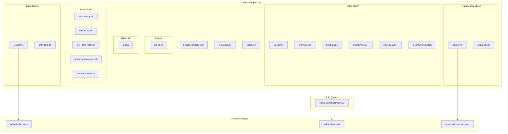

# Kafka Security POC - Design Document

## 1. Overview

### Summary

This POC validates that a Spring Boot application can securely communicate with an Apache Kafka broker using:
- **Mutual TLS (mTLS)** authentication with certificates issued by Smallstep step-ca
- **ACL-based authorization** restricting topic access to specific certificate CNs
- **PEM certificates** with Spring Boot SSL Bundles for simplified configuration

### Key Goals

1. Spring Boot application authenticates to Kafka using a client certificate
2. Kafka broker authenticates to clients using a server certificate
3. ACLs restrict topic access to authorized certificate CNs only
4. Unauthorized clients (valid cert, wrong CN) are denied topic access

### Constraints

- Docker Compose deployment environment
- Apache Kafka with KRaft mode (no Zookeeper)
- Builds on patterns from `~/src/smallstep-cert-example`
- PEM certificates with Spring Boot SSL Bundles
- Simple JSON message format

---

## 2. Domain View

### Diagram



### Domain Elements

| Element | Responsibility |
|---------|---------------|
| **Message** | Domain entity representing a message with id, content, and timestamp. Immutable record type. |
| **MessageProducer** | Service that sends messages to the Kafka topic. Handles serialization and delivery confirmation. |
| **MessageConsumer** | Listener that receives messages from Kafka and stores them in the repository. |
| **MessageRepository** | In-memory store for consumed messages. Enables retrieval via REST API. |
| **MessageController** | REST API exposing POST /messages (send) and GET /messages (retrieve). |
| **MessageRequest** | DTO for incoming message requests containing only the content field. |
| **KafkaConfig** | Spring configuration providing SSL-enabled Kafka producer and consumer factories. |

### Domain Patterns

- **Record types** for immutable domain objects (Message, MessageRequest)
- **Service layer** for Kafka operations (MessageProducer, MessageConsumer)
- **Repository pattern** for message storage (simple in-memory implementation)
- **Controller-Service separation** for REST API handling

---

## 3. Component View

### Diagram



### Component Responsibilities

| Component | Responsibility |
|-----------|---------------|
| **Certificate Authority (step-ca)** | Issues X.509 certificates for all components. Provides root CA certificate for trust establishment. Single source of trust for the entire system. |
| **Message Broker (Kafka)** | Receives and stores messages on the `secure-messages` topic. Requires mTLS for all connections. Enforces ACLs based on client certificate CN. |
| **ACL Authorizer** | Built into Kafka. Maps certificate CNs to permissions. Only `kafka-client.local` CN has READ/WRITE access to the topic. |
| **Kafka Client Application** | Spring Boot application with REST API. Produces messages to Kafka when POST is called. Consumes messages and stores in memory. |
| **Unauthorized Client** | Test component with valid mTLS certificate but CN not in ACL. Used to verify ACL enforcement. |

### Component Interfaces

| Interface | Protocol | Port | Purpose |
|-----------|----------|------|---------|
| step-ca API | HTTPS | 9000 | Certificate issuance and CA root retrieval |
| Kafka SSL | SSL/TLS | 9093 | Secure message production and consumption |
| REST API | HTTPS | 8443 | Client-facing message API |
| Actuator | HTTPS | 8443 | Health check endpoint at /actuator/health |

### Inter-Component Communication

1. **Certificate Provisioning**: All components request certificates from step-ca during startup
2. **Message Flow**: REST API → Producer → Kafka → Consumer → Repository
3. **Health Monitoring**: Actuator exposes Kafka connectivity status

---

## 4. Deployment View

### Diagram



### Container Specifications

| Container | Base Image | Purpose |
|-----------|-----------|---------|
| **stepca** | `smallstep/step-ca` | Private certificate authority |
| **kafka** | `confluentinc/cp-kafka:7.5.0` + step CLI | Kafka broker with mTLS |
| **kafka-init** | `confluentinc/cp-kafka:7.5.0` | Init container - creates topic/ACLs, then exits |
| **kafka-client** | `eclipse-temurin:21-jre` + step CLI | Spring Boot application |
| **unauthorized-client** | `eclipse-temurin:21-jre` + step CLI | Negative test client |

### Infrastructure Components

| Component | Technology | Configuration |
|-----------|-----------|---------------|
| **Certificate Storage** | Docker volumes | `stepca-data` (external), per-container `/certs` |
| **Message Storage** | Kafka topics | `secure-messages` (authorized), `restricted-topic` (denied) |
| **Network** | Docker bridge | Default compose network with DNS |

### Security Infrastructure

| Aspect | Implementation |
|--------|---------------|
| **Authentication** | mTLS with client certificates |
| **Authorization** | Kafka ACLs mapped to certificate CN |
| **Secrets** | Environment variables via .env file |
| **Trust** | step-ca root certificate distributed to all containers |

### Startup Sequence

Execute these commands in order:

```bash
# 1. Initialize CA (one-time setup)
./scripts/init-ca.sh

# 2. Start all services (CA, Kafka, init container, client)
docker compose up -d

# 3. Run tests
./test-scripts/test-end-to-end.sh
```

The `kafka-init` container automatically:
- Waits for Kafka to be ready (via health check dependency)
- Creates `secure-messages` topic (authorized for `kafka-client.local`)
- Creates `restricted-topic` (no access for `kafka-client.local`)
- Configures ACLs for both topics
- Exits after completion

### Shutdown Sequence

```bash
# Stop all containers
docker compose down

# To fully reset (including CA state):
docker compose down -v
docker volume rm stepca-data
```

---

## 5. Build View

### Diagram



### Repository Structure

```
kafka-security-poc/
├── docker-compose.yml           # Service orchestration
├── .env.example                 # Environment template
├── .gitignore                   # Ignore .env, build outputs
├── README.md                    # Setup and usage instructions
│
├── scripts/
│   └── init-ca.sh               # Initialize step-ca, generate .env
│
├── kafka-init/
│   └── init.sh                  # Create topic and configure ACLs (runs in container)
│
├── test-scripts/
│   ├── test-cleanup.sh          # Remove containers/volumes for clean state
│   ├── test-init-ca.sh          # Test CA initialization
│   ├── test-kafka-ready.sh      # Test Kafka broker readiness and topic exists
│   ├── test-acl-enforcement.sh  # Test ACL denies unauthorized client
│   └── test-end-to-end.sh       # Master test script (runs all tests)
│
├── kafka-broker/
│   ├── Dockerfile               # cp-kafka + step CLI
│   └── entrypoint.sh            # Request cert, configure SSL, start Kafka
│
├── kafka-client/
│   ├── Dockerfile               # temurin:21-jre + step CLI
│   ├── entrypoint.sh            # Request cert, start app
│   ├── build.gradle             # Spring Boot 3.4, Spring Kafka
│   ├── settings.gradle          # Project settings
│   └── src/
│       ├── main/
│       │   ├── java/com/example/kafkaclient/
│       │   │   ├── KafkaClientApplication.java
│       │   │   ├── config/KafkaConfig.java
│       │   │   ├── controller/MessageController.java
│       │   │   ├── model/Message.java
│       │   │   ├── service/MessageProducer.java
│       │   │   ├── service/MessageConsumer.java
│       │   │   └── repository/MessageRepository.java
│       │   └── resources/application.yml
│       └── test/java/com/example/kafkaclient/
│           ├── controller/MessageControllerTest.java
│           └── service/MessageProducerTest.java
│
└── unauthorized-client/
    ├── Dockerfile               # temurin:21-jre + step CLI
    └── entrypoint.sh            # Request cert with unauthorized.local CN
```

### Dataflow

#### Certificate Provisioning Flow

```
init-ca.sh
    │
    ├── Creates stepca-data volume
    ├── Initializes step-ca with demo-provisioner
    ├── Extracts CA fingerprint
    └── Generates .env file with:
            CA_FINGERPRINT=<fingerprint>
            PROVISIONER_PASSWORD=<password>
                    │
                    ▼
        docker-compose.yml (loads .env automatically)
                    │
    ┌───────────────┼───────────────┐
    ▼               ▼               ▼
kafka-broker    kafka-client    unauthorized-client
entrypoint.sh   entrypoint.sh   entrypoint.sh
    │               │               │
    ├── Reads CA_FINGERPRINT, PROVISIONER_PASSWORD from environment
    ├── Bootstraps trust: step ca bootstrap --fingerprint $CA_FINGERPRINT
    ├── Fetches root cert: step ca root /certs/ca.crt
    ├── Requests certificate: step ca certificate <CN> /certs/client.crt /certs/client.key
    └── Starts application (SSL Bundle reads PEM files directly)
```

#### Message Flow

```
External Client
    │
    │ POST /messages {"content": "Hello"}
    ▼
MessageController
    │
    │ Creates Message(uuid, content, now())
    ▼
MessageProducer
    │
    │ KafkaTemplate.send("secure-messages", message)
    │ Uses SSL Bundle configured in application.yml
    ▼
Kafka Broker
    │
    │ Validates client certificate (mTLS)
    │ Checks ACL for CN=kafka-client.local
    │ Stores message on topic
    │
    │ Delivers to consumer group
    ▼
MessageConsumer
    │
    │ @KafkaListener receives message
    ▼
MessageRepository
    │
    │ Stores in ConcurrentHashMap
    │
    │ GET /messages
    ▼
MessageController returns List<Message>
```

### Build Pipeline

| Stage | Command | Output |
|-------|---------|--------|
| **Java Build** | `./gradlew build` (in kafka-client/) | `build/libs/kafka-client-0.0.1-SNAPSHOT.jar` |
| **Docker Build** | `docker compose build` | Local container images |
| **Test** | `./test-scripts/test-end-to-end.sh` | Pass/fail status |

### Testing Strategy

Per the `testing-scripts-and-infrastructure` skill:

| Test Script | Observable Outcome |
|-------------|-------------------|
| `test-init-ca.sh` | CA responds to health check, fingerprint is valid |
| `test-kafka-ready.sh` | Kafka accepts SSL connections, both topics exist |
| `test-acl-enforcement.sh` | Unauthorized client denied `secure-messages`; authorized client denied `restricted-topic` |
| `test-end-to-end.sh` | Runs all tests in sequence, reports overall status |

Per the `test-runner-java-gradle` skill:
- Java unit tests run via `./gradlew test`
- Unit tests use mocked Kafka (no containers required)
- Integration with real Kafka tested via shell scripts

---

## 6. Key Design Decisions

### Decision 1: PEM Files with SSL Bundles

**Choice**: PEM files with Spring Boot 3.2+ SSL Bundles instead of PKCS12 keystores

**Rationale**:
- Spring Boot 3.2+ supports `spring.kafka.ssl.bundle` for Kafka SSL configuration
- Eliminates PKCS12 conversion step in entrypoint scripts
- Consistent with reference project (`smallstep-cert-example`) which uses SSL Bundles
- Simpler certificate handling - use PEM files directly from step-ca
- Cleaner entrypoint scripts with fewer dependencies (no `openssl pkcs12` commands)

### Decision 2: Entrypoint-Based Certificate Provisioning

**Choice**: Request certificates in container entrypoint scripts rather than pre-provisioning

**Rationale**:
- Consistent with reference project (`smallstep-cert-example`)
- Certificates are ephemeral (24-hour validity)
- No certificate storage in version control
- Each container restart gets fresh certificates
- Fingerprint-based CA verification prevents MITM

### Decision 3: Init Container for Topic/ACL Setup

**Choice**: Docker init container (`kafka-init`) rather than separate manual script

**Rationale**:
- Fully automated - `docker compose up` handles everything
- Init container runs once, creates topic and ACLs, then exits
- Uses `depends_on` with health check to wait for Kafka readiness
- Self-contained deployment without manual steps

### Decision 4: In-Memory Message Repository

**Choice**: ConcurrentHashMap for message storage

**Rationale**:
- POC scope - no persistence requirements
- Simplifies testing
- Sufficient for demonstrating Kafka communication
- No database infrastructure needed

### Decision 5: Two-Topic Design for ACL Demonstration

**Choice**: Two topics - `secure-messages` (authorized) and `restricted-topic` (denied)

**Rationale**:
- Demonstrates ACL enforcement in both directions (allow AND deny)
- `kafka-client.local` has access to `secure-messages` only
- `kafka-client.local` is denied access to `restricted-topic`
- Proves authorized clients are still restricted to specific topics

### Decision 6: Shell Scripts for Infrastructure Testing

**Choice**: Shell scripts test infrastructure; JUnit tests Java code

**Rationale** (per `testing-scripts-and-infrastructure` skill):
- Shell scripts verify observable outcomes (Kafka ready, ACL enforcement)
- JUnit tests verify Java application logic with mocked dependencies
- Never use shell scripts to test Java applications directly

---

## 7. Technical Risks and Mitigations

### Risk 1: Certificate Timing Issues

**Risk**: Containers may start before step-ca is ready, causing certificate requests to fail.

**Mitigation**:
- Use `depends_on` with `condition: service_healthy` in Docker Compose
- step-ca container defines a health check
- Dependent containers (kafka, kafka-client) only start after step-ca is healthy
- No polling logic needed in entrypoint scripts

### Risk 2: Kafka ACL Principal Mapping

**Risk**: Kafka may not correctly extract CN from client certificates for ACL matching.

**Mitigation**:
- Configure `ssl.principal.mapping.rules` if needed
- Test explicitly with `test-acl-enforcement.sh`
- Log principal during ACL evaluation for debugging

### Risk 3: Private Key Protection

**Risk**: PEM private key files could be exposed if container volumes are misconfigured.

**Mitigation**:
- Private keys stored only in container-local `/certs` directory
- Keys not mounted to shared volumes
- File permissions set to 600 in entrypoint scripts

### Risk 4: Kafka KRaft Controller Startup

**Risk**: KRaft mode requires careful configuration for single-node operation.

**Mitigation**:
- Use proven Confluent cp-kafka image
- Reference working KRaft configurations
- Test broker readiness before dependent operations

---

## 8. Open Questions

### Q1: Certificate Renewal Strategy

The current design uses 24-hour certificates without automatic renewal. For a production system, how should certificate renewal be handled?

**Options**:
- step-ca automatic renewal with ACME protocol
- Sidecar container for renewal
- Application-level certificate reload

**Deferred**: Out of scope for POC

### Q2: Kafka Controller Authentication - RESOLVED

**Decision**: SSL for controller listener

**Rationale**: Consistent security posture - all Kafka listeners use SSL. Demonstrates fully secured Kafka configuration.

### Q3: Client Certificate CN Validation - RESOLVED

**Decision**: Server-only HTTPS for REST API (no client certificate required)

**Rationale**: The POC focuses on Kafka security. REST API security is orthogonal and adds complexity.

---

## Change History

### 2026-02-04: SSL for Kafka controller listener

Changed from PLAINTEXT to SSL for controller listener:
- Consistent security posture across all listeners
- Demonstrates fully secured Kafka configuration

### 2026-02-04: Simplified container startup with health checks

Use `depends_on: condition: service_healthy` instead of polling in entrypoint scripts:
- Cleaner separation of concerns
- Docker Compose handles orchestration, entrypoints handle application startup

### 2026-02-04: Added second topic for ACL demonstration

Added `restricted-topic` that `kafka-client.local` cannot access:
- Demonstrates ACLs work in both directions (allow AND deny)
- Enhanced test coverage for ACL enforcement

### 2026-02-04: Changed to init container for topic/ACL setup

Replaced manual `setup-acls.sh` script with `kafka-init` container:
- Fully automated startup with `docker compose up`
- Init container waits for Kafka, creates topic/ACLs, then exits
- Simplified startup sequence

### 2026-02-04: Changed to SSL Bundles with PEM files

Replaced PKCS12 keystore approach with Spring Boot 3.2+ SSL Bundles:
- Simpler entrypoint scripts (no openssl conversion step)
- Consistent with reference project pattern
- Updated dataflow and risk sections accordingly

### 2026-02-04: Initial design document

Created comprehensive design document covering:
- Domain model for message handling
- Component architecture with step-ca, Kafka, and Spring Boot client
- Deployment view with Docker Compose
- Build structure following skill guidelines
- Key design decisions and rationale
